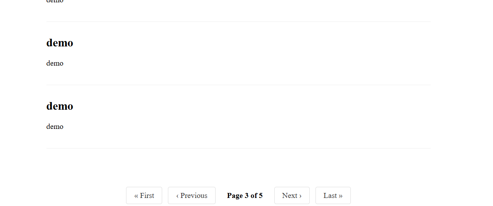

# 📘 pj_19_django – Django Pagination System

Pagination is one of the most common features in web applications like blogs, search engines, and any list of results. To simplify the process of implementing pagination, Django provides a powerful built-in `Paginator` class. This project demonstrates how to use Django's `Paginator` to efficiently divide content across multiple pages.

---

## 🚀 Features

- Clean and user-friendly pagination system
- Supports navigation between multiple pages of data
- Easily customizable and extendable
- Demonstrates Django’s built-in `Paginator` class in action

---

## 📦 Installation
 
# don't forget to create and venv

python -m venv venv
source venv/bin/activate  # On Windows: venv\Scripts\activate

1. **Clone the repository**
   ```bash
   git clone <repository-url>
   cd pj_19_django
   cd myproject

myproject/
│
├── manage.py
├── requirements.txt
├── blog/
│   ├── models.py
│   ├── views.py       ← Implements pagination logic
│   ├── urls.py
│   └── templates/
│       └── index.html  ← Displays paginated content
├── myproject/
│   ├── settings.py
│   └── urls.py

mv "Screenshot 2025-06-26 091440.png" assets/pagination_preview.png

## 📸 Pagination Preview

Here’s how the pagination UI looks in the browser:


